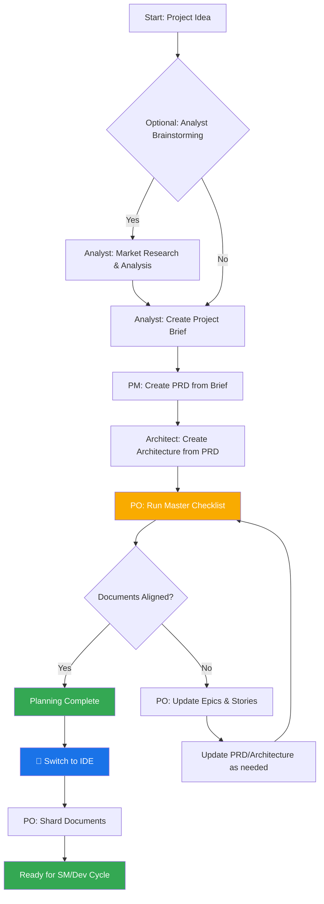
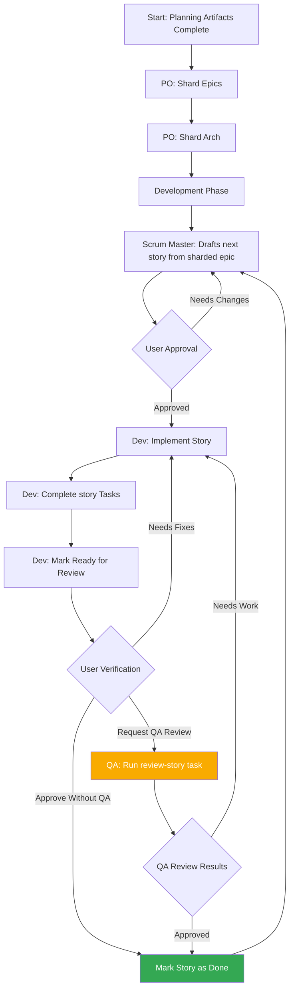
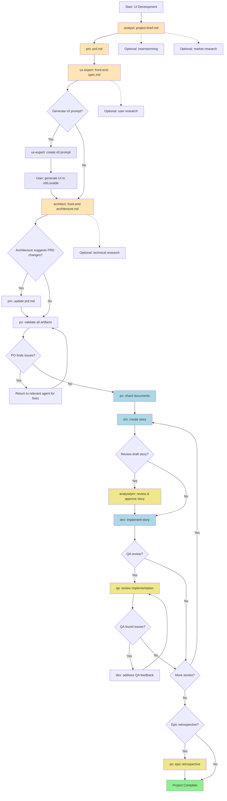
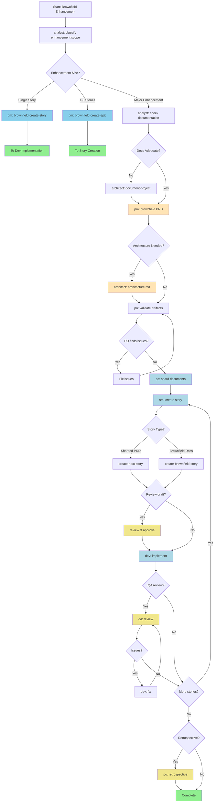
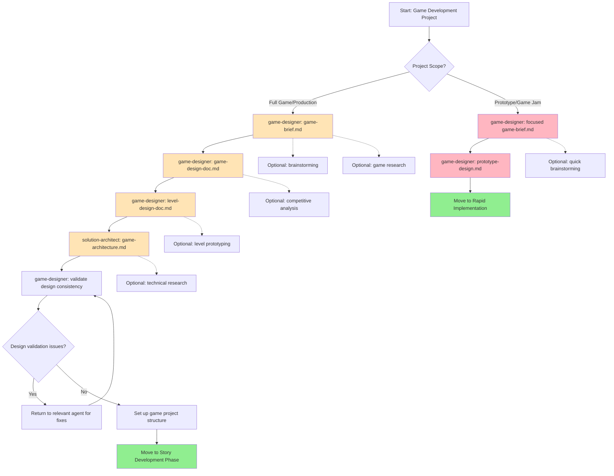

# BMAD-METHOD Workflow Diagrams

## 1. Core Planning Workflow

## 2. Core Development Cycle

## 3. Greenfield Fullstack Workflow

## 4. Greenfield UI Workflow

## 5. Brownfield Fullstack Enhancement

## 6. Game Development Workflow

## How to Preview These Diagrams

1. **Open this file** (`workflow-diagrams.md`) in Cursor
2. **Right-click on any mermaid code block** and select "Open Preview" or "Preview Mermaid"
3. **Or use the command palette**: `Cmd+Shift+P` → "Mermaid: Preview"
4. **Or install additional Mermaid extensions** if needed:
   - "Mermaid Markdown Syntax Highlighting"
   - "Mermaid Preview"

## Alternative Methods

### Using Live Server
If you want to see the diagrams in a browser:
1. Install the "Live Server" extension (you already have it)
2. Right-click on this markdown file
3. Select "Open with Live Server"
4. The diagrams will render in your browser

### Using GitHub
You can also view these diagrams directly on GitHub, as GitHub natively supports Mermaid diagrams in markdown files. 